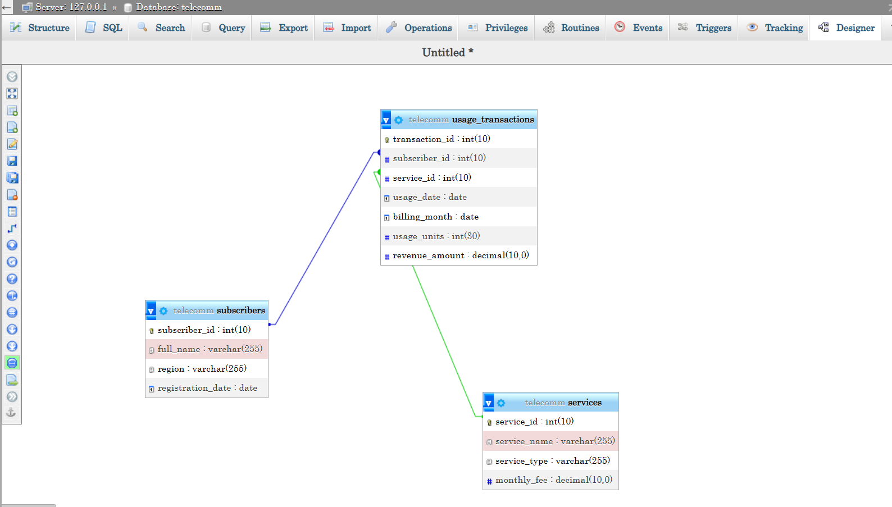

# plsql_window_functions_-28311-_-Ken-
SQL Stuff

#TELEFLEX

#Problem Definition

.Business Context

The company operates in the telecommunications industry, with analysis centered on the customer operations and revenue analytics unit. The organization provides voice, data, and messaging services to subscribers across multiple regions and time periods.

Data Challenge

Large volumes of subscriber usage and billing data are generated daily, making it challenging to compare customer performance and service revenue trends over time. Standard summary reports do not adequately reveal rankings, growth patterns, or behavioral differences among customers and regions.

Expected Outcome

This analysis seeks to rank subscribers and services by revenue, monitor period-over-period usage changes, and segment customers into performance tiers. The insights will support better pricing strategies, targeted retention campaigns, and improved regional performance management.

STEP 2 — Success Criteria

1.Determine the top five subscribers by revenue within each region → Achieved using RANK() to rank subscribers based on total revenue per region.

2.Generate running monthly revenue totals for each telecom service → Implemented with SUM() OVER (PARTITION BY service_type ORDER BY billing_month) to analyze revenue trends over time.

3.Analyze month-to-month revenue changes for individual subscribers → Uses LAG() to compare current month revenue with the previous billing period.

4.Classify subscribers into four revenue-based segments → Uses NTILE(4) to divide customers into quartiles based on spending behavior.

5.Calculate a three-month moving average of service revenue or usage → Implemented with AVG() OVER (ORDER BY billing_month ROWS BETWEEN 2 PRECEDING AND CURRENT ROW) to smooth short-term fluctuations.

Step 3: Database Schema Design Design
at least three (3) related tables with primary and foreign keys. An ER diagram is mandatory

Step 4: Part A — SQL JOINs Implementation Demonstrate correct and meaningful use of SQL JOINs using the tables from Step 3. Required JOIN Types

1️⃣ INNER JOIN Comment:This query will help us retrieve transactions with valid customers and services.

Bussiness Interpretation This query displays only valid usage transaction linked to real subscribers and services. It represents actual revenue-generating activity for the telecom.

2️⃣ LEFT JOIN Comment: this will help us to Identify customers who have never made a transaction.

Business interpretation.

The result shows that all registered subscribers are active users. This indicates good customer engagement with the company’s services.

3️⃣ RIGHT JOIN Comment:this wil help us detect services with no sales activity.

Business interpretation.

Every service offered by the company has generated usage. This shows that all products are contributing to business activity.

4️⃣ FULL OUTER JOIN Comment : this shall help us compare subscribers and services including unmatched records

Business interpretation.

This query provides a complete overview of customer–service relationships. It confirms that all customers and services are actively connected through usage.

5️⃣ SELF JOIN This will help us Compare subscribers within the same region

Business interpretation.

The query checks for multiple subscribers in the same region. In this dataset, subscriberrs are evenly distributed acros regions.

Step 5: Part B — Window Functions Implementation.

Implement all four categories of window functions.

1.Ranking functions ROW_NUMBER, RANK, DENSE_RANK, PERCENT_RANK Use case: Top customers by total revenue

Interpretation This query ranks subscribers based on the total revenue they generate. It helps identify top-performing customers and understand their relative contribution to revenue.

2️⃣ Aggregate Window Functions SUM, AVG, MIN, MAX (ROWS & RANGE) Use case: Running totals and revenue trends

Query 1: ROWS frame

Interpretation This query calculates a running total of revenue over time.Each row shows the cumulative revenue up to that transaction date.. Query 2: RANGE frame We switch to a numeric column (transaction_id) to legally use RANGE for my version

Interpretation This query calclates the average revenue across all transactions up to the current transaction. Using a RANGE frame groups rows based on numeric orderingIt helps analyse revenue trends across transaction progression.

Key Insights.

Descriptive — What happened?
Revenue analysis shows clear differentiation among subscribers and regions. A limited number of high-value subscribers account for a significant share of total revenue, while running revenue trends indicate stable but uneven growth across services and billing periods. Customer segmentation confirms distinct revenue tiers within the subscriber base.

Diagnostic — Why did it happen?
Revenue disparities are driven by differences in subscriber usage behavior and service consumption levels. 
Top-ranked subscribers consistently generate higher revenue due to sustained or increasing usage, while lower tiers reflect limited or inconsistent service engagement. 
Regional variations suggest differences in market demand, service adoption, or customer profiles.

Prescriptive — What should be done next?
The company should prioritize retention and personalized offers for high-value subscribers to protect core revenue streams.
Mid-tier customers represent an opportunity for upselling through targeted service bundles and pricing incentives.
Regions or services with slower growth should be evaluated for network performance, pricing competitiveness, and marketing effectiveness, with ongoing monitoring through analytical dashboards built on window functions.

References
1.Oracle. SQL Analytical (Window) Functions. Oracle Database Official Documentation.
2.PostgreSQL Global Development Group. Window Functions. PostgreSQL Official Documentation. 
3.W3Schools. SQL Window Functions Tutorial. Used for syntax clarification and examples. 
4.YouTube. SQL Tutorials. Educational videos used to reinforce understanding of SQL functions and JOIN operations.

“All sources were properly cited. Implementations and analysis represent original work. No AIgenerated content was copied without attribution or adaptation.”
